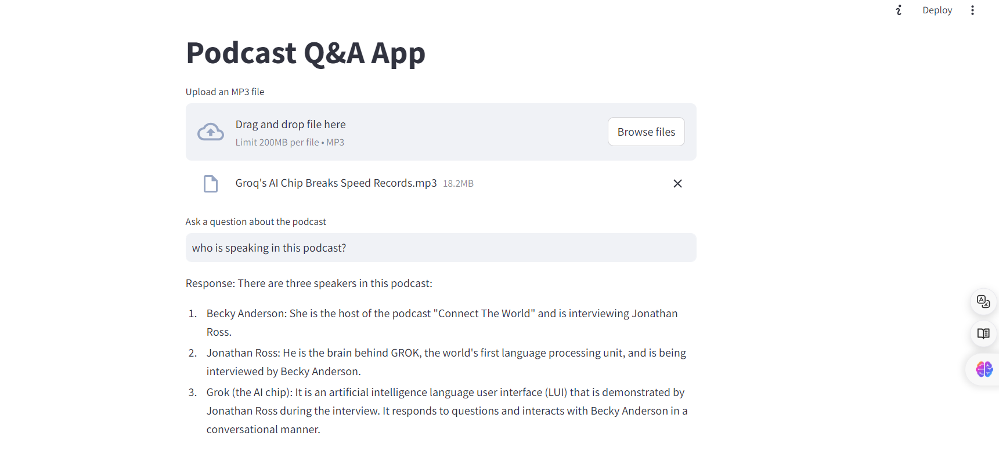

# Podcast Transcription and Q&A Project

## Overview 🎙️

This project provides an end-to-end solution for processing podcast audio files and transforming them into interactive, searchable content. The pipeline allows users to upload a podcast MP3 file, converts it into text using Whisper, and then allows for question-answering using embeddings stored in Pinecone. The system provides seamless interaction with the podcast content, making it easier to navigate and extract valuable information.

## Key Features ✨

- **Audio Chunking**: Podcast MP3 files are split into smaller audio chunks for better handling and processing
- **Speech-to-Text**: Using Whisper, each audio chunk is transcribed into text, ensuring high-quality transcription
- **Q&A System**: Users can ask questions based on the podcast transcript. The system uses the transcript's embeddings to return accurate answers
- **Embeddings with Pinecone**: Text chunks are embedded into vector format and stored in Pinecone for quick retrieval during the question-answering process

## Project Workflow 🔄

1. **Upload Podcast MP3**: The user uploads a podcast MP3 file
2. **Chunking**: The MP3 file is split into smaller chunks
3. **Speech-to-Text**: Each chunk is transcribed into text using the Whisper model
4. **Embeddings Generation**: The transcribed text is split into smaller chunks and converted into embeddings using sentence-transformers or other embedding models
5. **Storing Embeddings**: The embeddings are stored in Pinecone, a vector database for fast retrieval
6. **Question Answering**: Users can ask questions based on the podcast, and the system retrieves relevant chunks using Pinecone embeddings to provide accurate answers

## Project Architecture 🏗️

1. **Podcast MP3 → MP3 Chunks**: The MP3 is split into smaller audio chunks
2. **Speech-to-Text Conversion**: Whisper converts these audio chunks into text
3. **Embeddings Generation**: Text chunks are converted into vector embeddings for storage
4. **Embeddings Storage (Pinecone)**: Vector embeddings are stored and managed in Pinecone
5. **Interactive Q&A**: Users can ask questions and receive answers from the embedded text data

## Requirements 📋

- Python 3.8 or higher
- Virtual environment management tool (venv, conda, etc.)
- All dependencies listed in `requirements.txt`

## Installation and Setup 🛠️

### 1. Clone the repository

```bash
git clone <repository-url>
cd <repository-folder>
```

### 2. Create and activate virtual environment

#### Using venv (Python's built-in virtual environment)
```bash
# Create virtual environment
python -m venv venv

# Activate virtual environment
# On Windows
venv\Scripts\activate
# On macOS/Linux
source venv/bin/activate
```

#### Using conda
```bash
# Create conda environment
conda create -n venv python=3.12

# Activate conda environment
conda activate venv
```

### 3. Install dependencies

```bash
# Make sure your virtual environment is activated
pip install -r requirements.txt
```

### 4. Run the Streamlit app

```bash
streamlit run app.py
```

### 5. Usage
Upload a podcast MP3 and interact with the transcription through the Q&A interface.

## Tech Stack 🛠️

- **Groq**: For optimizing the audio processing pipeline
- **Langchain**: For creating modular and scalable components for question-answering
- **Pinecone**: A vector database for managing embeddings and facilitating the Q&A process
- **Streamlit**: A lightweight web app framework for creating interactive user interfaces
- **Whisper**: A powerful model for converting speech to text
- **Pydub**: Used for handling and chunking audio files
- **Sentence-Transformers**: For generating embeddings from text chunks
- **Tiktoken**: For tokenizing text

## Troubleshooting 🔍

If you encounter any dependency-related issues:
1. Make sure your virtual environment is activated
2. Verify Python version compatibility: `python --version`
3. Try upgrading pip: `pip install --upgrade pip`
4. If using conda, ensure conda-forge channel is added: `conda config --add channels conda-forge`

## License 📄

The source code for the project is licensed under the MIT license, which you can find in the [LICENSE.md](LICENSE.md) file.

## Contributing 🤝

1. Fork the project
2. Create your feature branch (`git checkout -b feature/AmazingFeature`)
3. Commit your changes (`git commit -m 'Add some AmazingFeature'`)
4. Push to the branch (`git push origin feature/AmazingFeature`)
5. Open a Pull Request

